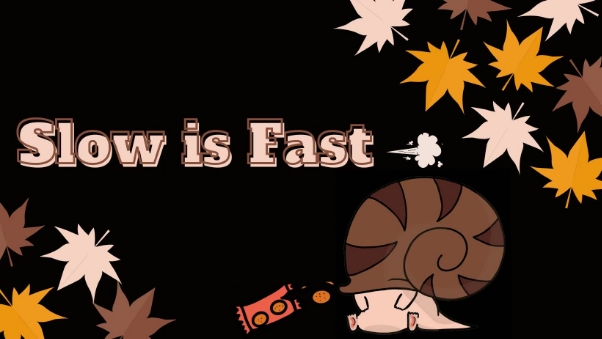
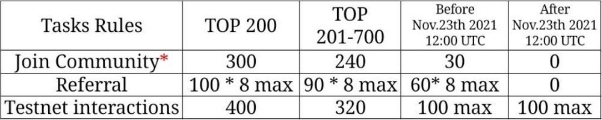
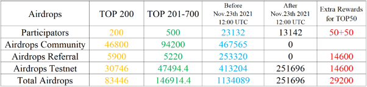
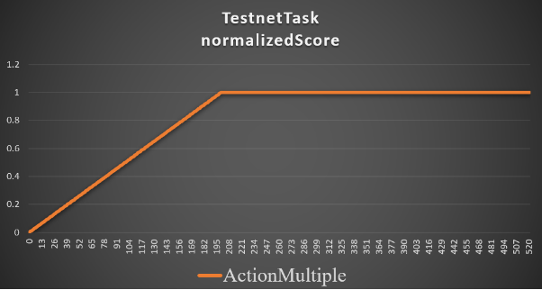

# Snails Finance Airdrop Event Results Overview.

In total we had **36,974** valid participants across all events. We are honored that so many people have joined our community during these events.
<!--truncate-->

This number counts people who correctly completed tasks before **UTC 12:00 Dec 17th, 2021**.

Within this there are:

1. **23,832** people before **UTC 12:00 Nov 23rd, 2021**. These users can get community, referral and testnet airdrops if they have participated in each specific task.

   For details see:[>Testnet-Launch-Event-1<](https://snails.fi/news/Testnet-Launch-Event-1)

2. **13,142** people after **UTC 12:00 Nov 23rd, 2021** can get testnet interactive airdrops if they participated in testnet testing.

3. Total task rewards are **1,616,145.4**. Extra rewards are **29,200**. Total airdrops are **1,645,345.4**. These airdrops will be distributed after our Mainnet launch. We have a reserve of the left **354,654.6** tokens (from **2,000,000** possible event total) to reward people with outstanding contributions to snails. (See extra rewards in **Table 2**)

4. You can **check your airdrop results with you NEAR mainnet address** at[**https://www.snails.fi**](https://www.snails.fi)

   (4a.) To check the airdrop result, user need to login with mainnet at[www.snails.fi](http://www.snails.fi), which may cost approximatley 0.00004 NEAR

   (4b.)<https://app.snails.fi> continues to still support only **Testnet** login.

5. If you have any problem with your results displaying please fill in this form:

   [>Airdrop Issues Form<](https://forms.gle/zhdn6rPf98TmFeZE7)

6. If you have submitted an incorrect format of mainnet or testnet address for example, there was no “.near” in your mainnet address or no “.testnet” in your testnet address, your calculations may be incorrect.

   
Table 1

   
Table 2

**Airdrop Rules & Calculations**

1. The airdrop amount for each user depends on the scores of completed tasks.

   The final airdrop is equal = ***FullAirdropAmounts*** \* ***normalizedTaskScore***

2. Community task. ***FullAirdropAmounts*** are shown in **Table 1**.

   If you both join Snails official telegram and retweet, ***normalizedTaskScore*** = 1.

   If you finish one of them, ***normalizedTaskScore*** = 0.5.

    If you did none of them, ***normalizedTaskScore*** = 0.

   If you submitted to the airdrop google form after UTC 12:00 Nov 23th, ***normalizedTaskScore*** = 0.

3. Referral task.

   ***FullAirdropAmounts*** are shown in **Table 1**.

   You can obtain +1 score if you have +1 referral. The maximum of this score is 8.

   For details see:[>Testnet-Launch-Event-1<](https://snails.fi/news/Testnet-Launch-Event-1)

   If you submit the airdrop google form after UTC 12:00 Nov 23rd, this score = 0.

   For details see:[>Testnet-Launch-Event-1<](https://snails.fi/news/Testnet-Launch-Event-1)

4. We see that some people made extra contributions to snails during our testnet period either by huge amounts of referrals of huge number of testnet tests. We have decided to make an extra token reward for the **top 50 users** on referral and testnet tasks. (See extra rewards in **Table 2**)

5. Testnet task. ***FullAirdropAmounts*** are shown in **Table 1**.

   We have 10 core functions in Snails testnet. We recorded the types and function usage counts for each user.

   The types of functions of each user were between 0–10, while function usage counts of each user can be 0-infinite. Considering the ***ActionMultiple*** = ***typesOfFunctionsOfUsage*** \* ***countsOfFunctionsOfUsage***.

   We expect each user operates each function twice. So we set:

   ***normalizedTaskScore*** = 1 when ***ActionMultiple***>=200 and a linear score is applied to calculate **normalizedTaskScore**.

   ***normalizedTaskScore*** = ***ActionMultiple*** / 200 (0 <= ***ActionMultiple*** < 200)

   ***normalizedTaskScore*** = 1 (***ActionMultiple*** > 200)

   

**Join and follow our channels and stay tuned for more updates & events as we move towards Snails Finance on mainnet.**

**Our Official Links**:

**Website**:<https://www.snails.fi>
**Twitter**:<https://twitter.com/snails_fi>
**Discord**:<https://discord.gg/JbRfABTftJ>
**Telegram**:<https://t.me/snailsfi>
**Medium**:<https://snailsfi.medium.com/>

Yours sincerely,

Snails team

