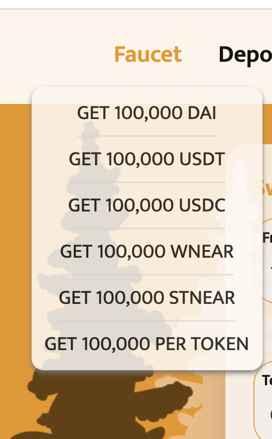

# Snails Finance v0.5 Testnet Tutorial

With the v0.5 testnet going live recently, we wanted to ensure the process of testing out our technologies is as simple as possible! So we took the time to make a nice guide for you all — see below for a thorough guide on how to access and use testnet v0.5 with a chance to earn the **Snails Pioneer Role**!
<!--truncate-->

The first step is to click the button to the right of the navigation bar. It will take you to the NEAR testnet wallet page and allow you to connect your testnet wallet. If you do not have a NEAR testnet wallet, you will need to create one. Refer to the[NEAR Official Tutorial](https://docs.near.org/docs/develop/basics/create-account#creating-a-testnet-account) for help in creating a new wallet.
### **Step 2: Obtain testnet test-tokens from the Faucet**

Go to the first tab on the navigation bar entitled ‘Faucet’. From here, you are able to get 100,000 of each available token within a 24 hour period. It will take several seconds for the tokens to enter your wallet so please wait patiently.

It is worth noting that you could also just click ‘GET 100,000 PER TOKEN’ to receive 100,000 of all the tokens listed above. Once the notification tells you the transaction was executed successfully, check your balance on the deposit page or your Near testnet wallet to verify the deposition of tokens.
#### **-If you are a trader and only want to do a swap, skip step3 and jump to step4.**
#### **-If you are a liquidity provider who wants to obtain LP to earn swapping fees and farming rewards, continue to step3.**
### **Step 3: Deposit your tokens to the smart contract — (Why do I need to Deposit? See FAQ-Q1 below)**

To add liquidity to the 3 Snail Pool or NEAR pool, you must first deposit your balances to the smart contract (Why do I need to Deposit? **See FAQ-Q1 below**). The operation will take between 30–60 seconds, depending on how many different tokens you want to add at the same time. Once you deposit successfully, you can view it in the “Deposited Balance” or in “Snails Account”.

Note: There will be a storage fee for each token when you deposit this token for the first time. This fee will be refunded if you unregister this token from contract.

If you want to withdraw the tokens from “Snails Account” to your NEAR wallet, simply change the amount of tokens using the slider and click the ‘withdraw’ button.
### **Step 4: Swapping (Will I need to deposit if I am only swapping tokens? See FAQ-Q2 below.)**

On the swap page, there are two available options for swapping.

1. **Direct swap** — if you choose Direct Swap, you can swap tokens in your NEAR wallet, with the swapped token going directly to your NEAR wallet, (similar to Uniswap or Pancake)!
1. **Deposit swap** — if Deposit Swap is chosen, your swapped tokens are from your “Snails Account” and to your “Snails Account”. So deposit swap is used to swap assets that have been deposited in our smart contract.
### **Step 5: Adding liquidity to the Snails Finance pools**

There are two pools now live on Snails Finance: **3Snails Pool** and **NEAR Pool.** 3Snails Pool is a stablecoin pool with DAI-USDT-USDC while NEAR pool is consist of wNEAR-stNEAR.

If you plan to become a liquidity provider and earn trading fees or farming rewards, you can now add liquidity to those pools.

There are two methods for adding liquidity: **custom** and **balanced**. The default is ‘custom’, which means you can add any amount of tokens lower than your balance to the pool, however, adding liquidity in an unbalanced way will result in a shift from current token reserves, therefore will charge you fees. The more unbalanced proportion of tokens you add, the more fees the system will charge so be conscious of this when adding liquidity!

The second choice is ‘balanced’. With this method, you are not charged any trading fees and once the input amount of one token is changed, the protocol will automatically calculate the rest amount of tokens needed based on the proportion of reserved tokens in the pool.

Note: Once you have successfully obtained the LP tokens, you could earn trading fees from traders. You can also boost your rewards by staking your LP tokens to farm. So let’s go to Farm section!
### **Step 6: Farm**

After adding liquidity to the pools, you can stake your LPs to the farm to earn and then claim your SNAIL rewards.

After you claim your snails, you are able to withdraw them to your NEAR wallet. The second line of the image above shows the balance of SNAIL in your NEAR wallet.
### **Step7: Remove Liquidity**
There are three types of removing liquidity: **single, balanced** and **multiple.**

Go to the ‘pools’ page — there you will see the option to remove liquidity. Before removing any liquidity, check the “Staked” and “Unstaked” LP in the below. Staked LP means your liquidity that is currently staked in the farm. You can only remove “Unstaked” liquidities here.

**7.1 liquidity removal option: ‘single’ (default)**

By single mode, you can convert your LP tokens to a single type of token. The disadvantage of this mode is this mode will make reserves unbalanced and there will always be trading fees. So be caution of the slippage and minimum receive tokens when using single mode!

Choose your desired token, select the amounts of LP tokens to be removed and you will see your desired token amounts to receive. Then hit the “Remove Liquidity” button.

**7.2 liquidity removal option: ‘balanced’**

By balanced mode, you will receive output tokens in a balanced way, based on the proportion of tokens in the pool. The advantage of this mode is there will be “zero fees”.

Simply select the amounts of LP tokens to be removed, and you will see the tokens out. Then hit the “Remove Liquidity” button.

**7.3 liquidity removal option:** **‘multiple’**

By multiple mode, you can remove liquidity in a free style. You can choose the type of tokens you’ll receive and choose how many you’ll receive from the pool as you wish, without the need of the weight to be proportional to the pool aka unbalanced proportion. However, as the protocol encourages balanced token reserves, the more unbalanced proportion of tokens you remove, the more fees the system will charge accordingly.

Enter** the amount of each token you want to receive, the maximum burned LP tokens will show. Then hit the “Remove Liquidity” button.
### **FAQ**
1. **Why users sometimes need to “Deposit” first?**

The difference of transfer mechanism between ERC20/BEP20 and NEAR

Why users need to deposit their tokens to the pool first? This is the most frequently asked question. The reason is because of NEAR protocol design philosophy. In ERC20 there is an “approve” function for a smart contract to transfer tokens from address A to address B.

**The function is similar to below**:

A.approve(C)

C.transfer(fromA, toB, tokens)

However, “there is no stage gate or approval process” for a smart contract in NEAR. The NEAR protocol has no “approve” function for A, which is different from what we experience from ERC20 or BEP20 protocol. So if the swap pool wants to transfer tokens which are originally from A, to B, A needs to hand over the ownership of his tokens to the swap pool first.

The process will be like this:

A.transfer(toC, tokens) Here is why we need to deposit first.

C.transfer(toB, tokens)

Remember there is NO function like C.transfer(fromA, toB, tokens) in NEAR protocol.

**2. Do I have to deposit now?**

If you are a **trader** who only requires to swap, then **NO**! Just use the new “Direct Swap” function on the tab labeled “SWAP”.

If you are a **liquidity provider** who wants to obtain LP tokens to earn swapping fees and farming rewards, then **YES**! The main reason for this is the architecture of NEAR protocol. (see<https://snails.fi/news/Testnet-Launch-Event-2> Q&A-Q1). We are researching this to find a safe and convenient solution for our users.

**3. Why 3Snails pool uses DAI-USDT-USDC**

Rainbow 2.0 Tokens

We planned to launch the USDT-USDC-BUSD pool initially, which is based on the Rainbow Bridge 1.0 token list. But BUSD is not supported in Rainbow Bridge 2.0 yet, the 3Snails pool is now made up of DAI, USDT and USDC. However, it will be suitable to implement BUSD pool at the right time.

Note: More stablecoins like nUSDO will be integrated into the stable pool in the future.

**4. Why does DAI have a different accuracy than other tokens like USDC ?**

DAI has a decimal of 18, while USDT and USDC have decimal accuracy of 6.
#### [**Please Report any Bugs or Suggestions in our form >CLICK HERE<**](https://forms.gle/qL3NrJvfxfU3w4Dd8)
Good Suggestions and Bug Reports have a chance to earn the **Snails Pioneer Role** with benefits including priority access to our future events such as NFT sales and increased voting rights on DAO proposals.

### **Our Official Links:**
Website:[www.snails.fi](http://www.snails.fi/)
Twitter:[twitter.com/snails_fi](https://twitter.com/snails_fi)
Discord:[discord.gg/JbRfABTftJ](http://discord.gg/JbRfABTftJ)
Telegram:<https://t.me/snailsfi>
News:<https://snails.fi/news>
Medium:<https://snailsfi.medium.com/>

*Yours sincerely,*
*Snails team*