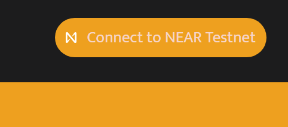
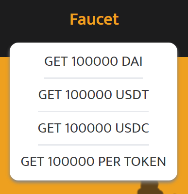

# Testnet Launch Event (2)

We are happy to announce that Snails Testnet is open now. Welcome to visit our testnet, pioneers! You can discuss with others in[>Snails Discord<](https://discord.gg/JbRfABTftJ) **#testnet channel or in[>Telegram<](https://t.me/snailsfi)**. We really appreciate for your valuable suggestions and will review all of them.

Snails Testnet Website:<https://app.snails.fi>
<!--truncate-->

### **Testnet Turorials**
**Step1: Connect to your NEAR Testnet wallet.**

Step1: Connect to your NEAR Testnet wallet

Click “Connect to NEAR Testnet” button at the topright of the testnet page to connect your **Testnet** wallet . You may need to create a NEAR testnet wallet if you don’t have one. If you need assistance in creating NEAR testnet wallet, you can obtain solutions in[NEAR official turorial](https://docs.near.org/docs/develop/basics/create-account#creating-a-testnet-account).

**Step2: Obtain testnet stablecoins from “Faucet”.**

Step2:Obtain testnet stablecoins from Faucet.

Each user can get up to 100,000 for each token within 24 hours. This process may take several seconds or more. If this process takes too long, please refresh the website and try to get tokens again. If succeed, there will be a notification like: Transfer USDC 100000 to xxx.testnet successfully.

**Step3: Deposit your tokens to smart contract. (Why Deposit? See Q&A-Q1 below.**)

Step3: Deposit (This process is frustrating but for swappers, it will be skipped in future)

If you want to add liquidity to “3Snails pools”, you need to deposit your balances to smart contract first. You can withdraw the deposited tokens to your wallet by “Withdraw”.

**Step4: Swap stablecoins. (Do I need to deposit if only swap? See Q&A-Q2 below.**)

Step4: Swap different stablecoins

Swapping should be a familiar part for defi users.

**Step5: Add liquidity to 3Snail Pool**

Step5: Add Liquidity- “custom”

If you are a stablecoin liquidity provider to earn trading fees or to farm, you can “Add Liquidity” to 3Snails Pool now. There are two types for adding liquidity. Default is a “custom” which means you could add any coin of any amount within your balances. However, adding liquidity in an unbalanced way will cause trading fees. The more unbalanced you add multi-coins, the more fees the system will charge.

Step5: Add Liquidity- “balanced”

You could also add liquidity in a balanced way. Once you input a stablecoin amount, DApp will calculated the rest stablecoins amounts to maintain pool’s weight.

Click the “Add Liquidity” button and use your NEAR wallet to authorize the transaction, you would get a certain number of 3Snails-LPs.

*Notes: Price of 1LP should always ≥ 1 and will increase slowly.*

**Step6: Farm**

Step6: Farm

By staking LPs into the Farm system, you can earn SNAIL token continuously.

**Step7: Remove Liquidity**

Before you remove 3Snails-LP liquidity, you need to Unstake your staked 3Snail-LP from the Farm system.

Step7: Remove Liquidity-”balanced”

Remove liquidity “balanced” means you obtain all types of stablecoins from the pool in a weight proportional to the pool.

Step7: Remove Liquidity-”custom”

If you only want to remove liquidity in one stablecoin type, choose the “custom” method. Here you need to choose your favored type of stablecoin in the checkbox, then click “Remove Liquidity” to convert the LPs to this type.
### **Q&A**
1. **Why “Deposit”?**

The difference of transfer mechanism between ERC20/BEP20 and NEAR

Why users need to deposit their tokens to the pool first? This is the most frequently asked question. The reason is because of NEAR protocol design philosophy. In ERC20 there is an “approve” function for a smart contract to transfer tokens from address A to address B. The function is something like below:

*A.approve(C)*

*C.transfer(fromA, toB, tokens)*

However, “[there is no stage gate or approval process”](https://docs.near.org/docs/faq/developer-faq) for a smart contract in NEAR. The NEAR protocol has no “approve” function for A, which is different from what we experience from ERC20 or BEP20 protocol. So if the swap pool want to transfer tokens which is originly from A, to B, A need to hand over the ownership of his tokens to swap pool first. The process will be like this:

*A.transfer(toC, tokens)* Here is why we need to deposit first.

*C.transfer(toB, tokens)*

Remember there is **NO** function like *C.transfer(fromA, toB, tokens)* in NEAR protocol.

**2. If I only want to swap, do I need to “Deposit”?**

For now, yes. But shortly after, no! We have found tricks that allow users to swap from token A(such as DAI) to token B(such as USDC) directly without depositing them first. We believe this is the most important step to improve user experience in Snails APP!

*Note: Deposit is always needed by user who want to add liquidity to pools.*

**3. Why 3Snails pool uses DAI-USDT-USDC**

Rainbow 2.0 Tokens

[We planned to launch USDT-USDC-BUSD pool initially](https://snails.fi/news/Snails-Recent-Roadmap-and-Airdrop-Event), which is based on the Rainbow Bridge 1.0 token list. But BUSD is not supported in Rainbow Bridge 2.0 yet, the 3Snails pool is now made up of DAI, USDT and USDC. However, it will be suitable to implement BUSD pool at the right time.

### **Our Official Links:**
Website:[www.snails.fi](http://www.snails.fi/)
Twitter:[twitter.com/snails_fi](https://twitter.com/snails_fi)
Discord:[discord.gg/JbRfABTftJ](http://discord.gg/JbRfABTftJ)
Telegram:<https://t.me/snailsfi>
News:<https://snails.fi/news>
Medium:<https://snailsfi.medium.com/>

*Yours sincerely,*
*Snails team*